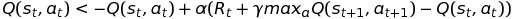
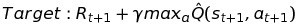

# AI-Lunar-Lander-TF-v1
A Reinforcement Learning AI Agent that use Deep Q Network to play Lunar Lander

* Implementation: Tensorflow v1
* Algorithm: Deep Q-Network with a single Fully Connected Neural Network.
 
**Description**
* The agent has to learn how to land a Lunar Lander to the moon surface safely, quickly and accurately.
* If the agent just lets the lander fall freely, it is dangerous and thus get a very negative reward from the environment.
* If the agent does not land quickly enough (after 20 seconds), it fails its objective and receive a negative reward from the environment.
* If the agent lands the lander safely but in wrong position, it is given either a small negative or small positive reward, depending on how far from the landing zone is the lander.
* If the AI lands the lander to the landing zone quickly and safely, it is successful and is award very positive reward.

* Since the state space is infinite, traditional Q-value table method does not work on this problem. As a result, we need to integrate Q-learning with Neural Network for value approximation. However, the action space remains discrete.

**Q-learning:** 
  

The equation above based on Bellman equation. You can try creating a sample graph of MDP to see intuitively why the Q-learning method converge to optimal value, thus converging to optimal policy.

* For Deep Q-learning, we simply use a NN to approximate Q-value in each time step, and then update the NN so that the estimate Q(s,a) approach its target: 
*  
*   

  It has been proven mathematically and practically that using this approximation, the algorithm with converge to optimal policy in reasonable amount of time.

  
**Records on AI's evolution** 
**First 10 trials:**
* Unstable
* AI behaved no better than random behaviors
* The lander just collide with the ground, no clear goal  
Link: https://youtu.be/JrHB2YwNZGo   

**First 30 trials:**
* AI now learned how to control the lander appropriately to stay in the air longer
* It learned that it should not let the lander collide with the ground (as the Q-value for those behaviors are very negative from the previous experience)
* The lander still collide with the ground, but it seems a little bit better  
Link: https://youtu.be/Ih4ngczwZXc  

**First 60 trials:**
* AI now learned how to land the lander safely
* However, the position is not exactly in the landing zone, and it still takes the lander quite long time to actually land on the ground.
Link: https://youtu.be/3PO7iqdHfl4  

**Final:**
* AI now learned how to land the lander safely, quickly, and accurately.
Link: https://youtu.be/p0eLKrLpW8w

**Comparision of performance** 

* 10 episodes: 

